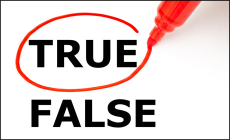
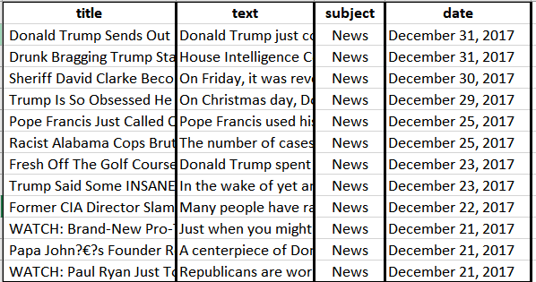

# Data incubator Project: News-Detector
## Talbe of conents
1. [Motivation](#1-motivation)
2. [The Database](#2-the-database)
3. [Initial Analysis](#3-Initial-Analysis)
        * [3.1 Sentence Strucutre](#31-input-layer)
	* [3.2 Eye tracking ](#32-convolutional-layers)  
	* [3.3 News Spreading](#33-dense-layers)
3. [To be added](#5-to-be-added)

## 1 Motivation
In the COVID-19 pandemic, false reports dominated at the early response. If we could select the true and useful suggestion from the news at the early response, we may be able to open the economy earlier and save more lives. Fortunately, with the help of data science, human intelligence can forcast the validity of news. By analyzing proven news, we could conclude features of fake news and true news. Through the comparsion of unproven news with proven news, we are be albe to forcast the validty of any news. 

## 2 The Database
News in Text

<i>Figure 1. Proven fake news in text</i>

(https://github.com/wentianliao/News-Detector/tree/master/Proven%20data)

News in Videos 

<i>Figure 1. Proven fake news sample</i>

(https://github.com/wentianliao/News-Detector/tree/master/Proven%20data)

## 3 Initial Analysis
1. Sentence Structure anaysis

2. Eye tracking  

3. News Spreading

## 4 Initial Analysis

## 5. To be added

Are ready to pitch your project by explaining your analysis and what you hope to do. We are especially impressed with strong existing work and analysis.
Keep working on your projects, and make sure you can present more than what you were able to complete during the challenge.
Have a compelling intro. Who is the project useful for? How will it help them? Why should others find it interesting?
Have memorable takeaways. These should show how your project solves a problem, technical accomplishments, and interesting aspects of the data.
Be specific. Tell us about how much data you analyzed, the tools and techniques you used, and any other information that will set your work apart.
Be concise. You only get 2–3 minutes to convince the panel. Make sure you've got your presentation as succinct as possible.
Be prepared. Don't read off a script. Practice your presentation in front of a mirror, your mom, your roommate, your cat.
Be natural. We want to get a sense of the real you, so take a deep breath and remember that, while you may work with a lot of machines and computers, you're still human.
