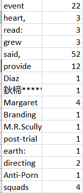

# Data incubator Project: News Detector
## Talbe of conents
1. [Motivation](#1-motivation)
2. [The Database](#2-the-database)
	* 2.1 News in Text
	* 2.2 News in Video
3. [Initial Analysis](#3-Initial-Analysis)
	* 3.1 Sentence Structure 
	* 3.2 Micro Expression
	* 3.3 News Spreading
4. [Reference](#4-Reference)

## 1 Motivation
In the COVID-19 pandemic, false reports dominated at the early response. If we could select the true and useful suggestion from the news at the early response, we may be able to open the economy earlier and save more lives. Fortunately, with the help of data science, human intelligence can forcast the validity of news. By analyzing proven news, we could conclude features of fake news and true news. Through the comparsion of unproven news with proven news, we are be albe to forcast the validty of any news. 

## 2 The Database
### 2.1 News in Text

<i>Figure 1. Proven fake news in text</i>

	

	

<i>Figure 2. Data of Proven fake news in text</i>
	

(https://www.kaggle.com/clmentbisaillon/fake-and-real-news-dataset)
	
Around 25000 Fakes news with title, txt, subject and date are analyzed.

### 2.2 News in Videos 

	

<i>Figure 3. Proven fake news in video </i>

## 3 Initial Analysis
### 3.1. Sentence Structure anaysis
#### Current results:

	

<i>Figure 4. Word_frequency_in_fake_data_sample</i>
	

（https://github.com/wentianliao/News-Detector/tree/master/Results/Word_frequency_in_fake_data.csv）
	
#### In progress:
* More data pre-processsing needed to elminate  punctuation.

* See if there is any words which are both popular in Fake news and True news.

* Find the words which is only popuar in fake enws.

### 3.2. Micro Expression analysis
#### Current results:

	

<i>Figure 5. Actual Thresholded Image</i>
	

	

<i>Figure 6. Ideal Thresholded Image</i>
	

	

<i>Figure 7. Removed background makes eye blink more obvious</i>
		

### 3.3 News Spreading analysis

## 4 Reference
1. The code to count word frequency comes from Will P.
(https://stackoverflow.com/questions/21946606/word-count-for-all-the-words-appearing-in-a-column-in-sql-server-2008)

2. The code to remove background 
(http://www.petercollingridge.co.uk/blog/removing-background-avi-using-imagej)

